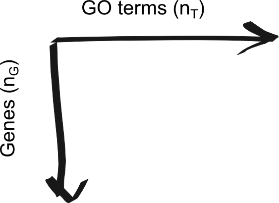

<!-- Custom Styles -->
<style type='text/css'>
    .title-slide {
        background: #e3f2fc;
        color: #2d4152;
    }
    slides > slide {
        height: 800px;
        margin-top: -400px;
    }
    img {
        max-height: 560px;
        max-width: 964px;
    }
    slide a {border-bottom: none;}
    .small li { font-size: 20px; }
    .smaller li p { font-size: 16px; }
    .caption { font-size: 14px; display: block; }
    .references li { font-size: 14px; }
    .references li p { font-size: 14px; }
</style>

<!-- Custom JavaScript -->
<script src="http://ajax.aspnetcdn.com/ajax/jQuery/jquery-1.7.min.js"></script>
<script type='text/javascript'>
$(function() {
    $("p:has(img)").addClass('centered');
});
</script>

## Overview

>- Recent high-throughput methods (microarray, RNA-Seq, etc) made it easy to
   produce large datasets comparing samples in different conditions.
>- The end result of many of these analyses, however, is often a large list of
   genes that are associated with one condition or the other.
>- Numerous tools have been developed to look for "enrichment" in these
   resulting gene sets for genes associated with a particular known pathway or
   functional annotation.
>- These methods (GSEA, etc) often use statistics which make some assumptions
   about the distribution of annotations which may not be valid.
>- What are the effects of these assumptions the resulting interpretation?
>- Can we do better?

---.segue .dark

## Background

---

## Many functional enrichment tools exist


<span class='caption'>Huang et al. (2009) Table 1</span>

---

## Common statistics used for enrichment analysis

- Fisher's Exact Test (FET)
- Binomial test
- Hypergeometric test
- Chi-squared test

All of these methods assume that, under the null hypothesis, genes are equally
likely to be selected.

---

## Gene Set Enrichment Analysis (GSEA)

- Most popular tool for enrichment analysis
- Uses variant of Kolmogorov–Smirnov test
  - Compares distributions of two samples
  - Null hypothesis: the samples were drawn from the same distribution
- Looks for enrichment in genes with a known property (e.g. GO annotation) at
  the top of a list of genes ranked by differential expression, etc.

---

## Gene Set Enrichment Analysis (GSEA)


<span class='caption'>Subramanian et al. (2005) Figure 1</span>

---

## Fisher's Exact Test (FET)

- The most common test statistic used for functional enrichment
- Considers the overlap between experiment gene set and set of genes with some
  known functional annotation.


---.segue .dark

## Annotation Enrichment Analysis

---

## Annotation Enrichment Analysis

- Downloaded all human gene-term associations from
  [GO](http://www.geneontology.org/).
- Constructed a gene/annotation bipartite graph, represented by an 
  $n_G \cross n_T$ adjacency matrix 



- $n_G$ - number of genes
- $n_T$ - number of GO terms


---.references

## References

```{r refs, include=FALSE}
library(knitcitations)
cleanbib()
citep('10.1038/srep04191')
citep('10.1093/nar/gkn923')
citep('10.1073/pnas.0506580102')
```

```{r refs_output, echo=FALSE, results='asis'}
bibliography('html')
```
