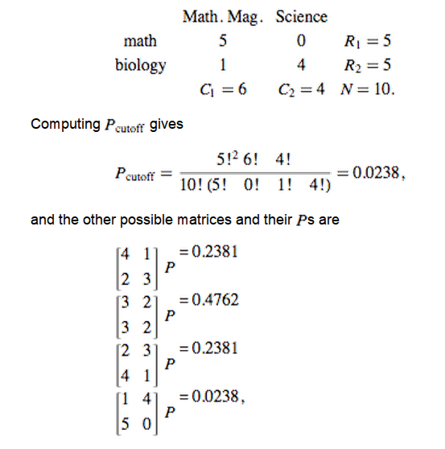
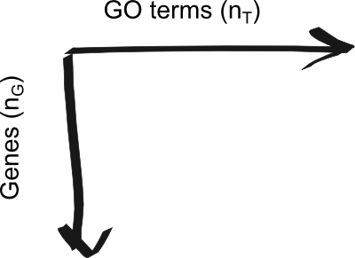
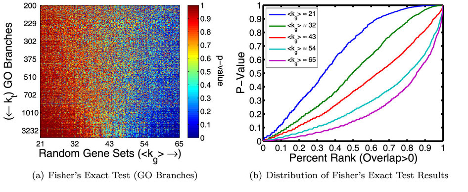

<!-- Custom Styles -->
<style type='text/css'>
    .title-slide {
        background: #e3f2fc;
        text-shadow: 2px 2px 5px #666;
        color: #2d4152;
    }
    slides > slide {
        height: 800px;
        margin-top: -400px;
    }
    img {
        max-height: 560px;
        max-width: 964px;
    }
    slide a {border-bottom: none;}
    .small li { font-size: 20px; }
    .smaller li { font-size: 18px; }
    .caption { font-size: 14px; display: block; }
    .references li { font-size: 14px; }
    .references li p { font-size: 14px; }
</style>

<!-- Custom JavaScript -->
<script src="http://ajax.aspnetcdn.com/ajax/jQuery/jquery-1.7.min.js"></script>
<script type='text/javascript'>
$(function() {
    $("p:has(img)").addClass('centered');
});
</script>

## Overview

>- Recent high-throughput methods (microarray, RNA-Seq, etc) made it easy to
   produce large datasets comparing samples in different conditions.
>- The end result of many of these analyses, however, is often a large list of
   genes that are associated with one condition or the other.
>- Numerous tools have been developed to look for "enrichment" in these
   resulting gene sets for genes associated with a particular known pathway or
   functional annotation.
>- These methods (GSEA, etc) often use statistics which make some assumptions
   about the distribution of annotations which may not be valid.
>- What are the effects of these assumptions the resulting interpretation?
>- Can we do better?

---

## Example motivation: T. cruzi co-expression network

One example of where this kind of enrichment analysis could be useful is for
determining possible roles for clusters of co-expressed genes.


<span class='caption'>T. cruzi co-expression network modules detected by
WGCNA</span>

---.segue .dark

## Background

---.quote

## Gene Ontology (GO)

### What is GO?

<q>The Gene Ontology is a controlled vocabulary, a set of standard terms—words
and phrases—used for indexing and retrieving information. In addition to
defining terms, GO also defines the relationships between the terms, making
it a structured vocabulary.</q> - geneontology.org

---.small

## Gene Ontology (GO)

### What is GO?

- Provides a common language to describe features of genes from all different
  species.
- GO database includes two main parts:
    - Ontologies
    - Gene annotations
- Includes three separate ontologies relating to:
    - Location (cellular component)
    - Process/pathway involved in (biological process)
    - Specific function (molecular function)
- Each ontology is represented by a directed acyclic graph (DAG).
- Two different types of relationships exist between nodes: 
    - *is-a*, and
    - *part-of*
- Deeper levels in the ontology correspond to more specific descriptions.
- Maintained and developed by a consortium of scientists ([Gene Ontology
  Consortium](http://www.geneontology.org/GO.consortiumlist.shtml))

---

## Gene Ontology (GO)

### Gene Ontology structure


<span class='caption'>
(source: http://www.geneontology.org/GO.ontology.structure.shtml)
</span>

---

## Many functional enrichment tools exist


<span class='caption'>Huang et al. (2009) Table 1</span>

---

## Common statistics used for enrichment analysis

- Fisher's Exact Test (FET)
- Binomial test
- Hypergeometric test
- Chi-squared test

All of these methods assume that, under the null hypothesis, genes are equally
likely to be selected.

---

## Gene Set Enrichment Analysis (GSEA)

- Most popular tool for enrichment analysis
- Uses variant of Kolmogorov–Smirnov test
  - Compares distributions of two samples
  - Null hypothesis: the samples were drawn from the same distribution
- Looks for enrichment in genes with a known property (e.g. GO annotation) at
  the top of a list of genes ranked by differential expression, etc.

---

## Gene Set Enrichment Analysis (GSEA)


<span class='caption'>Subramanian et al. (2005) Figure 1</span>

---

## GOstat

- Beißbarth & Speed (2004)
- Computes frequencies of all GO terms in two sets of genes:
  - Experiment set
  - Reference set (e.g. entire GO db)
- Uses $\chi^2$ and Fisher's Exact test to look for terms which are enriched in
  either gene set with respect to the other.
- Performs multiple testing correction using either Holm or Benjamini and
  Hochberg correction.
- Website: http://gostat.wehi.edu.au/
- Not to be confused with
  "[GOstats](http://www.bioconductor.org/packages/release/bioc/html/GOstats.html)",
  a Bioconductor package for working with GO and microarray data...

---

## GOSeq

- Young et al. (2010) notice biases between gene length, number of reads, and 
  differential expression.
- They show that GO categories also show a length bias (many categories have
  significantly longer or shorter genest than expected by chance), which
  indicates that enrichment results could in turn be skewed by DE length bias.
- GOSeq corrects for the length bias by random sampling of a fitted
  distribution based on length and DE proportion.


<span class='caption'>Young et al. (2010) Figure 2</span>

---.smaller

## Fisher's Exact Test (FET)

- The most common test statistic used for functional enrichment
- Considers the overlap between experiment gene set and set of genes with some
  known functional annotation.


<span class='caption'>(source:
http://mathworld.wolfram.com/FishersExactTest.html)</span>

---.segue .dark

## Results

---

## Gene ontology characteristics

### Gene-term graph

- Downloaded all human gene-term associations from the
  [Gene Ontology website](http://www.geneontology.org/).
- Constructed a gene/annotation graph, represented by an 
  $n_G \times n_T$ adjacency matrix 



- $n_G$ - number of genes
- $n_T$ - number of GO terms
- $A_{ij} = 1$ - Gene $i$ is annotated with term $j$
- $A_{ij} = 0$ - Gene $i$ is not annotated with term $j$

---

## Gene ontology characteristics

### Gene and term degree distributions


- <span class='red'>Biological Process</span> terms dominate the human
  annotations.
- Degree of term ($k_t$) distribution is "heavy-tailed"; most terms are
  associated with only a few genes, but some terms are used for a huge 
  number of genes.

---

## Gene ontology characteristics

### Biological Process

The remainder of the results are based on the biological process ontology:

- 656,783 annotations
- 15,213 genes (avg: 43.2 annotations)
- 10192 terms (avg: 64.4 annotations)

---

## Question: What is the effect of annotation database properties on functional enrichment analysis?

### Experiment design:

- Created 200 random gene sets:
  - $N_g$=200 genes in each set (a "typical" gene set size)
  - Varied number of annotations ($M_g$)
  - Determined FET enrichment score for each of the 10192 BP GO terms

### Results

  - Number of unique annotations $\propto$ GO enrichment significance!

---

## Random gene set enrichment scores



---

## Perhaps the problem isn't quite so bad after correcting for multiple testing...

- Multiple testing correction alone is not enough to deal with this bias,
  although it does seem to severely reduce the problem.


---

## Annotation Enrichment Analysis (AEA)


---

## Question: Does this bias also affect biologically relevant sets of genes?

### Overview

- So far, we've seen how AEA can correct for biases in the distribution of GO
  terms and annotation coverage across genes.
- Does this have any impact on downstream biological interpretations?

### Experiment design:

- Downloaded all expression signatures from
  [Gene Signatures Database (GeneSigDB)](http://compbio.dfci.harvard.edu/genesigdb/) which contain $100 <=
  n <= 1000$ genes which are annotated with a term in the BP ontology
  (total=309)
- First, plotted average number of annotations per gene set and compared it what would
  be expected for random sets of genes (verify presence of bias.)
- Next, measured enrichment in each set using FET and AEA and looked at
  properties of genes deemed significant in one measure but not the other.

---

## GeneSigDB Signatures

FET enrichment bias towards well-annotated genes is also present in biological
datasets:


---

## Question: Does AEA provide any additional biological insights?

### Experiment design:

- For FET and AEA, each:
    - Selected ~40 <span class='blue2'>GeneSigDB signatures</span> with the 
      most significant enrichment scores.
    - Select 40 <span class='blue2'>GO terms</span> with most significant 
      enrichment scores across all signatures.
- Performed hierarchical clustering.

---

## Functional enrichment clusters (FET vs. AEA)


- rows = gene signatures
- columns = GO terms

---

## Limitations

- Performance of AEA only compared with Fisher's Exact Test (FET); how does the
  performance comparew to other GO methods?
- Only looked at Biological Process ontology -- is the picture the same for the
  other GO sub-ontologies?
- Currently only implemented in C++ (R bindings would be nice.)

---.references

## References

```{r refs, include=FALSE}
library(knitcitations)
cleanbib()
citep('10.1038/srep04191')
citep('10.1093/nar/gkn923')
citep('10.1093/bioinformatics/bth088')
citep('10.1186/gb-2010-11-2-r14')
citep('10.1073/pnas.0506580102')
```

```{r refs_output, echo=FALSE, results='asis'}
bibliography('html')
```
- Weisstein, Eric W. "Fisher's Exact Test." From MathWorld--A Wolfram Web
Resource. http://mathworld.wolfram.com/FishersExactTest.html

